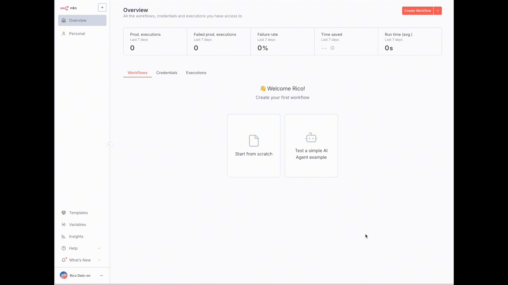

# Automated Scripted Shorts - AI Video Generation Workflow

## Overview ✨

This comprehensive automation system creates 100% AI-generated short-form videos and automatically posts them to TikTok, YouTube, and Instagram. The workflow leverages cutting-edge AI models including Google's V3 Fast video generation, OpenAI's GPT-4 for scripting, and ElevenLabs for voice synthesis to create engaging content without manual intervention.

🚀 The system generates high-quality video clips with synchronized voiceovers, automatic captions, and professional editing - all at a fraction of traditional production costs. Videos are created with proper hooks, builds, and resolutions to maximize engagement across social platforms. The automation handles everything from script generation to final upload, making it possible to run a complete content farm with minimal oversight.

The workflow is dynamic and intelligent, automatically determining the optimal number of video clips needed based on script length and content requirements. Each video is uniquely generated with contextually appropriate visuals that match the narration, ensuring coherent and engaging content output.

## Notes 📝

### Script Generation

- OpenAI GPT-4 generates complete video scripts with proper structure
- Scripts include hooks, builds, and resolutions for maximum engagement
- System outputs title, voice ID, and formatted script segments
- JSON formatting ensures clean data passing between workflow nodes

### Voice Synthesis & Audio Processing

- ElevenLabs converts scripts to natural-sounding human voices
- Audio files processed and timestamped for video synchronization
- Whisper-1 model creates SRT transcripts with precise timing
- Audio uploaded to Cloudinary for API-accessible URLs

### Video Generation Pipeline

- Dynamic scene calculation determines optimal clip count per video
- ChatGPT creates detailed visual prompts for each video segment
- Kling AI's V3 Fast model generates high-quality video clips
- System processes multiple clips simultaneously for efficiency

### Video Editing & Assembly

- Fal handles video concatenation and audio synchronization
- Cloudinary transforms remove unwanted ambient audio
- FFmpeg-based editing combines clips with custom voiceover
- Automatic caption generation adds professional subtitles

### Social Media Distribution

- Blastado API uploads to TikTok, YouTube, and Instagram simultaneously
- Platform-specific formatting and descriptions applied automatically
- Airtable logging tracks video status and provides monitoring dashboard
- Configurable scheduling prevents rate limiting across platforms

## Installation ⚙️

### Prerequisites

Before starting, ensure you have accounts for all required services:

# Required Platforms

- n8n.io (workflow automation)
- OpenAI Platform (API access)
- ElevenLabs (voice synthesis)
- Kling AI (video generation)
- Fal.ai (video editing)
- Cloudinary (file hosting)
- Airtable (data logging)
- Blastado (social media posting)

### Step-by-Step Setup

1.  **Create n8n Workflow**

```
# Login to your n8n I already installed it locally take a look at my projects profile in LinkedIn for the guide
# Create new workflow named "Automated Scripted Shorts"
# Set up manual trigger node
```



2.  **Configure OpenAI Integration**

```bash
# Get API key from platform.openai.com
# Add $5-10 in credits for testing
# Create credential in n8n with API key
# Set up chatgpt prompts for you voice
# execute the flow
```


3.  **Set Up ElevenLabs Voice Generation**

```bash
# Register at 11labs.io
# Copy API key from profile settings
# Configure HTTP request node with XI-API-Key header
# Set endpoint for text-to-speech conversion
```

4.  **Configure Video Generation (Kling AI)**

```bash
# Sign up at key.ai for Kling AI access
# Load credits for V3 Fast model usage
# Set up HTTP authentication with Bearer token
# Configure video generation and retrieval endpoints
```

5.  **Set Up Video Editing (Fal)**

```bash
# Create account at fal.ai
# Add billing credits (approximately $0.11 per video)
# Generate API key for video editing operations
# Configure composition and captioning endpoints
```

6.  **Configure File Storage (Cloudinary)**

```bash
# Sign up for free Cloudinary account
# Copy Cloud ID from dashboard
# Create unsigned upload preset
# Set up audio upload and transformation URLs
```

7.  **Set Up Data Logging (Airtable)**

```bash
# Create Airtable base named "Videos"
# Configure columns: ID (auto-number), Title, Status, Source
# Generate personal access token with full permissions
# Connect n8n to Airtable for status tracking
```

8.  **Configure Social Media Posting (Blastado)**

```bash
# Subscribe to Blastado ($29/month for unlimited uploads)
# Connect TikTok, YouTube, and Instagram accounts
# Copy API key and account IDs
# Set up platform-specific posting parameters
```

### Workflow Configuration

Copy the following node structure and paste into your n8n workflow:

```json
# Core workflow nodes (in order):
1. Manual Trigger
2. OpenAI Script Generation
3. ElevenLabs Voice Synthesis
4. OpenAI Transcript Generation
5. Airtable Status Logging
6. Scene Conversion (Code Node)
7. Video Prompt Generation
8. Scene Processing & Video Generation
9. Video Assembly & Caption Addition
10. Social Media Upload & Final Logging
```

### Cost Breakdown 💰

| Service            | Cost                | Usage                        |
| ------------------ | ------------------- | ---------------------------- |
| Kling AI (V3 Fast) | $2.00–3.00 per post | Video generation (5–8 clips) |
| Fal Composition    | $0.0002 per post    | Video editing                |
| Fal Captions       | $0.10 per post      | Automatic subtitles          |
| ElevenLabs         | $5–11 per month     | Voice synthesis              |
| Blastado           | $29 per month       | Social media uploads         |
| Airtable           | Free                | Data logging                 |
| Cloudinary         | Free                | File hosting                 |

**Total per video: ~$2.10-3.10 + monthly subscriptions**

## Additional Notes 📋

### Automation Scheduling

- Replace manual trigger with schedule trigger for full automation
- Recommended: 2-4 hour intervals to avoid platform rate limits
- YouTube caps at ~12 posts/day, TikTok similar limits
- Instagram posting should also be limited to prevent restrictions

### Customization Options

- Modify script generation prompts for different niches
- Adjust video generation parameters for style preferences
- Configure platform-specific descriptions and hashtags
- Set custom voice IDs for brand consistency

### Monitoring & Maintenance

- Use Airtable dashboard to track video status and performance
- Monitor API usage and costs across all platforms
- Regularly update prompts and examples for content variety
- Check platform policies for automation compliance

### Troubleshooting Tips

- Ensure all API keys have sufficient credits/permissions
- Verify Cloudinary upload presets are configured as "unsigned"
- Check that social media accounts are properly connected in Blastado
- Monitor n8n execution logs for any failed workflow steps
